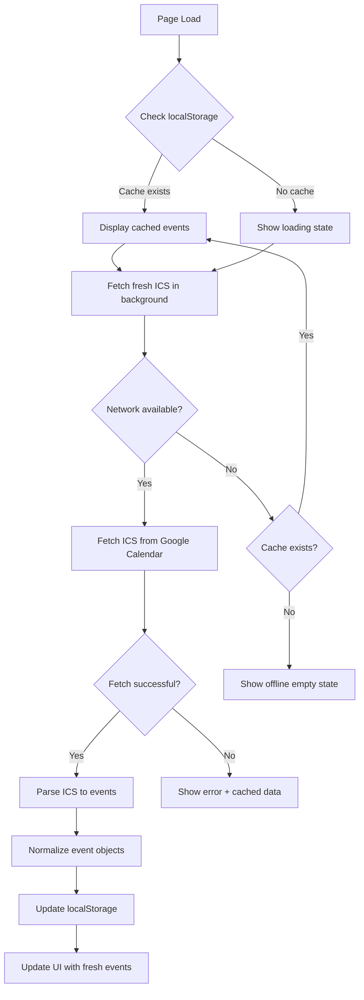

# Architecture Documentation - MOM Landing Page

## System Overview

Single-page, offline-first React web application with no backend. All content is static or fetched client-side from public APIs (Google Calendar ICS feed). Progressive Web App (PWA) capabilities enable offline functionality after first visit.

## Technology Stack

### Core
- **Vite 5.x**: Build tool and dev server
- **React 18.x**: UI library
- **TypeScript 5.x**: Type safety
- **Tailwind CSS 3.x**: Utility-first styling

### Additional Libraries
- **shadcn/ui**: Selective component usage (Button, Card, Dialog)
- **vite-plugin-pwa**: Service worker generation
- **ical.js** or **node-ical**: ICS calendar parsing (choose smallest)

### Build & Deploy
- **Vercel**: Hosting platform (static site deployment)
- **npm/pnpm**: Package management

## Folder Structure

```
website/
├── public/
│   ├── hero-video.mp4          # Hero background video
│   ├── placeholder-about.jpg   # About section image
│   ├── logos/                  # Client logo images
│   │   ├── client1.png
│   │   ├── client2.png
│   │   └── client3.png
│   └── manifest.json           # PWA manifest
│
├── src/
│   ├── components/             # Reusable UI components
│   │   ├── ui/                 # shadcn/ui components
│   │   │   ├── button.tsx
│   │   │   └── card.tsx
│   │   └── YouTubeEmbed.tsx    # Lazy-loading YouTube player
│   │
│   ├── sections/               # Page sections
│   │   ├── Hero.tsx
│   │   ├── About.tsx
│   │   ├── LogoSlider.tsx
│   │   ├── WhatWeDo.tsx
│   │   ├── YouTubeShowcase.tsx
│   │   └── Calendar.tsx
│   │
│   ├── content/                # Configuration and content
│   │   └── siteConfig.ts       # Single source of truth for content
│   │
│   ├── hooks/                  # Custom React hooks
│   │   ├── useLocalStorage.ts  # localStorage abstraction
│   │   └── useCalendarEvents.ts # Calendar fetch + cache logic
│   │
│   ├── lib/                    # Utilities and helpers
│   │   ├── calendarService.ts  # ICS fetch and parse
│   │   └── utils.ts            # General utilities
│   │
│   ├── types/                  # TypeScript type definitions
│   │   ├── calendar.ts         # Event, CalendarCache types
│   │   └── config.ts           # SiteConfig type
│   │
│   ├── App.tsx                 # Main app component
│   ├── main.tsx                # Entry point
│   └── index.css               # Global styles + Tailwind imports
│
├── docs/
│   ├── architecture.md         # This file
│   └── google-calendar-setup.md # Client guide for calendar
│
├── plans/
│   └── plan.md                 # Project plan and checklist
│
├── AGENT.md                    # Project instructions for AI
├── README.md                   # User-facing documentation
├── package.json
├── tsconfig.json
├── tailwind.config.js
├── vite.config.ts
└── .gitignore
```

## Data Flow by Section

### 1. Hero Section
```
siteConfig.ts (hero content)
    ↓
Hero.tsx component
    ↓
Renders:
- Video background (public/hero-video.mp4)
- Title overlay ("MOM")
- Tagline
- CTA Button (mailto or anchor link)
```

**Key Features**:
- Video autoplay/loop/muted
- Dark overlay for text contrast
- Responsive text sizing
- Fallback image if video fails

---

### 2. About Section
```
siteConfig.ts (about text + image path)
    ↓
About.tsx component
    ↓
Renders:
- Text content
- Image (public/placeholder-about.jpg)
- Two-column layout (stacks on mobile)
```

**Key Features**:
- Responsive layout (flex/grid)
- Proper image aspect ratio
- Semantic HTML (section, h2, p, img)

---

### 3. Logo Slider
```
siteConfig.ts (logos array)
    ↓
LogoSlider.tsx component
    ↓
Renders:
- Infinite horizontal marquee
- White logos on dark background
- CSS animation (no JS)
```

**Key Features**:
- Pure CSS animation (keyframes)
- Duplicate logo set for seamless loop
- Pause on hover (optional)
- Responsive sizing

---

### 4. What We Do Carousel
```
siteConfig.ts (whatWeDo array)
    ↓
WhatWeDo.tsx component
    ↓
Renders:
- Horizontal scroll container
- Cards: Kidsshow, Workshops, Concerts
- Icon + title + description per card
```

**Key Features**:
- CSS scroll-snap for smooth scrolling
- Touch/swipe support (native)
- Optional navigation dots
- Responsive card sizing

---

### 5. YouTube Showcase
```
siteConfig.ts (youtube.videoIds array)
    ↓
YouTubeShowcase.tsx component
    ↓
Maps videoIds to YouTubeEmbed components
    ↓
Renders:
- Grid layout (1-3 columns responsive)
- Lazy-loaded YouTube iframes
- Thumbnail preview → click → load iframe
```

**Key Features**:
- Lazy loading (performance)
- Responsive grid (CSS Grid)
- 16:9 aspect ratio containers
- Accessibility (iframe titles)

---

### 6. Calendar Section (Most Complex)



**Detailed Flow**:

1. **Component Mount** ([`Calendar.tsx`](../src/sections/Calendar.tsx))
   - Calls `useCalendarEvents()` hook
   - Hook checks localStorage for cached events
   - Displays cached events immediately (if available)

2. **Background Fetch** ([`calendarService.ts`](../src/lib/calendarService.ts))
   ```typescript
   async function fetchIcs(url: string): Promise<string> {
     const controller = new AbortController();
     const timeout = setTimeout(() => controller.abort(), 10000);
     
     try {
       const response = await fetch(url, { signal: controller.signal });
       clearTimeout(timeout);
       return await response.text();
     } catch (error) {
       // Handle timeout, network errors
       throw error;
     }
   }
   ```

3. **ICS Parsing**
   ```typescript
   function parseIcsToEvents(icsText: string): Event[] {
     // Use ical.js or node-ical
     // Extract: title, start, end, location, url
     // Filter future events only
     // Sort by start date ascending
     return events;
   }
   ```

4. **Caching** ([`useLocalStorage.ts`](../src/hooks/useLocalStorage.ts))
   ```typescript
   interface CalendarCache {
     events: Event[];
     fetchedAt: number; // timestamp
   }
   
   localStorage.setItem('mom-calendar-events', JSON.stringify(cache));
   ```

5. **UI Rendering**
   - List view: "Upcoming Shows"
   - Each event: title, date (formatted), location
   - "Last updated: X minutes ago" footer
   - Loading spinner during fetch
   - Error message if fetch fails
   - Empty state if offline + no cache

**Key Features**:
- Optimistic UI (show cache first)
- Background refresh
- Graceful degradation
- Clear error states
- Timestamp tracking

---

## Offline Strategy

### Service Worker (via vite-plugin-pwa)

**Configuration** ([`vite.config.ts`](../vite.config.ts)):
```typescript
import { VitePWA } from 'vite-plugin-pwa';

export default defineConfig({
  plugins: [
    react(),
    VitePWA({
      registerType: 'autoUpdate',
      includeAssets: ['hero-video.mp4', 'logos/*.png', '*.jpg'],
      manifest: {
        name: 'MOM Beatbox Crew',
        short_name: 'MOM',
        description: 'Official landing page for MOM beatbox crew',
        theme_color: '#000000',
        icons: [
          // PWA icons
        ]
      },
      workbox: {
        globPatterns: ['**/*.{js,css,html,ico,png,jpg,svg}'],
        runtimeCaching: [
          {
            urlPattern: /^https:\/\/calendar\.google\.com\/.*/i,
            handler: 'NetworkFirst',
            options: {
              cacheName: 'google-calendar-cache',
              expiration: {
                maxEntries: 10,
                maxAgeSeconds: 60 * 60 * 24 // 24 hours
              }
            }
          }
        ]
      }
    })
  ]
});
```

**What Gets Cached**:
- ✅ HTML, CSS, JS bundles (all)
- ✅ Static images (logos, about image)
- ✅ Fonts (if any)
- ⚠️ Hero video (optional - may be too large)
- ✅ Google Calendar ICS responses (NetworkFirst strategy)

**Cache Strategies**:
- **Static assets**: CacheFirst (immutable after build)
- **HTML**: NetworkFirst (check for updates)
- **Calendar ICS**: NetworkFirst + localStorage fallback

---

### localStorage Cache

**Purpose**: Persist calendar events for offline access

**Schema**:
```typescript
// Key: 'mom-calendar-events'
interface CalendarCache {
  events: Event[];
  fetchedAt: number; // Unix timestamp
}

// Event structure
interface Event {
  id: string;
  title: string;
  start: Date;
  end?: Date;
  location?: string;
  description?: string;
  url?: string;
}
```

**Lifecycle**:
1. **Write**: After successful ICS fetch + parse
2. **Read**: On component mount, before network fetch
3. **Update**: Every successful fetch (replace entire cache)
4. **Expiry**: Show "Last updated" but don't auto-delete (offline support)

---

## Build & Deploy

### Development
```bash
npm install
npm run dev
# Opens http://localhost:5173
```

### Production Build
```bash
npm run build
# Output: dist/ folder
# Includes service worker, manifest, optimized assets
```

### Deployment (Vercel)

**Option 1: CLI**
```bash
npm install -g vercel
vercel
# Follow prompts
```

**Option 2: Git Integration**
1. Push to GitHub
2. Import project in Vercel dashboard
3. Auto-deploys on push to main

**Build Settings**:
- Framework Preset: Vite
- Build Command: `npm run build`
- Output Directory: `dist`
- Install Command: `npm install`

**Environment Variables**: None required (all config in code)

---

## Type Definitions

### [`types/config.ts`](../src/types/config.ts)
```typescript
export interface SiteConfig {
  hero: {
    title: string;
    tagline: string;
    bookingEmail: string;
  };
  about: {
    text: string;
    imagePlaceholder: string;
  };
  logos: Array<{
    name: string;
    image: string;
  }>;
  whatWeDo: Array<{
    title: string;
    description: string;
    icon: string;
  }>;
  youtube: {
    videoIds: string[];
  };
  calendar: {
    publicIcsUrl: string;
  };
}
```

### [`types/calendar.ts`](../src/types/calendar.ts)
```typescript
export interface Event {
  id: string;
  title: string;
  start: Date;
  end?: Date;
  location?: string;
  description?: string;
  url?: string;
}

export interface CalendarCache {
  events: Event[];
  fetchedAt: number;
}

export interface CalendarState {
  events: Event[];
  loading: boolean;
  error: string | null;
  lastUpdated: number | null;
}
```

---

## Performance Considerations

### Bundle Size Targets
- **Total JS**: < 200KB (gzipped)
- **Total CSS**: < 50KB (gzipped)
- **Images**: Optimized, WebP where possible
- **Video**: Compressed, < 5MB (or don't cache in SW)
- **Overall**: < 500KB excluding video

### Optimization Techniques
1. **Code splitting**: Dynamic imports for heavy components (if needed)
2. **Lazy loading**: YouTube embeds, below-fold images
3. **Tree shaking**: Import only used shadcn/ui components
4. **Minification**: Vite handles automatically
5. **Compression**: Vercel serves gzipped/brotli

### Loading Strategy
1. **Critical path**: HTML, CSS, JS (inline critical CSS if needed)
2. **Above fold**: Hero video, title, CTA
3. **Below fold**: Lazy-load images, YouTube embeds
4. **Background**: Calendar fetch (non-blocking)

---

## Accessibility Features

### Semantic HTML
- `<header>`, `<main>`, `<section>`, `<footer>`
- Proper heading hierarchy (h1 → h2 → h3)
- `<nav>` for navigation (if added)

### ARIA Labels
- Video: `aria-label="Background video"`
- Buttons: Descriptive text or `aria-label`
- Links: Clear link text or `aria-label`
- Loading states: `aria-live="polite"`

### Keyboard Navigation
- All interactive elements focusable
- Visible focus states (Tailwind `focus:` utilities)
- Skip-to-content link (optional)
- Carousel: Arrow key navigation (if custom JS)

### Color Contrast
- Text on video overlay: WCAG AA minimum (4.5:1)
- All text: High contrast
- Focus indicators: Visible and distinct

---

## Error Handling

### Network Errors
- **Calendar fetch fails**: Show cached data + error banner
- **ICS parse fails**: Log error, show cached data
- **Offline + no cache**: Friendly empty state message

### User Feedback
- Loading spinners for async operations
- Error messages in plain language
- Success indicators (e.g., "Updated 2 minutes ago")

### Fallbacks
- Video fails to load → Show fallback image
- Image fails to load → Show placeholder or alt text
- Calendar unavailable → Show "Check back later" message

---

## Security Considerations

### Content Security Policy (CSP)
- Allow YouTube embeds: `frame-src https://www.youtube.com`
- Allow Google Calendar: `connect-src https://calendar.google.com`
- No inline scripts (Vite handles)

### Data Privacy
- No user tracking or analytics (by default)
- No cookies or personal data storage
- localStorage only for public calendar events

### Dependencies
- Regular updates via `npm audit`
- Minimal dependencies to reduce attack surface
- Use well-maintained libraries only

---

## Testing Strategy

### Manual Testing
1. **Browsers**: Chrome, Firefox, Safari, Edge
2. **Devices**: iPhone, Android, tablet, desktop
3. **Network**: Online, offline, slow 3G
4. **Scenarios**:
   - First visit (no cache)
   - Repeat visit (with cache)
   - Offline mode
   - Calendar update flow

### Automated Testing (Optional)
- Lighthouse CI for performance
- Playwright for E2E (if time permits)
- TypeScript strict mode catches type errors

---

## Future Enhancements (Out of Scope)

- ❌ Contact form (requires backend)
- ❌ User accounts or authentication
- ❌ Admin panel for content editing
- ❌ Analytics or tracking
- ❌ Multi-language support
- ❌ Blog or news section
- ❌ E-commerce or ticket sales

These can be added later if needed, but are not part of the MVP.

---

## Maintenance

### Content Updates
- Edit [`siteConfig.ts`](../src/content/siteConfig.ts)
- Replace images in `public/` folder
- Rebuild and redeploy

### Calendar Updates
- Client edits Google Calendar (no code changes)
- Events auto-refresh on page load

### Dependency Updates
```bash
npm outdated
npm update
npm audit fix
```

### Monitoring
- Vercel analytics (optional)
- Browser console for errors
- User feedback for issues

---

## Conclusion

This architecture prioritizes simplicity, performance, and offline-first functionality. By avoiding backend complexity and using public APIs (Google Calendar), we achieve a maintainable, client-editable solution that meets all requirements with minimal code.
