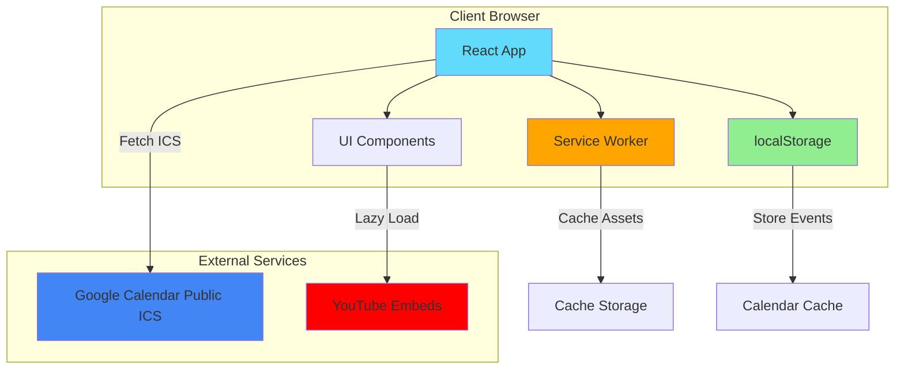
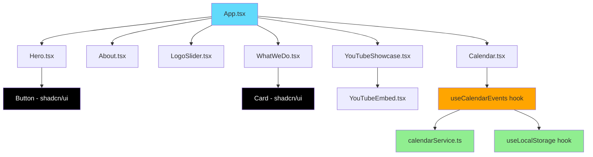
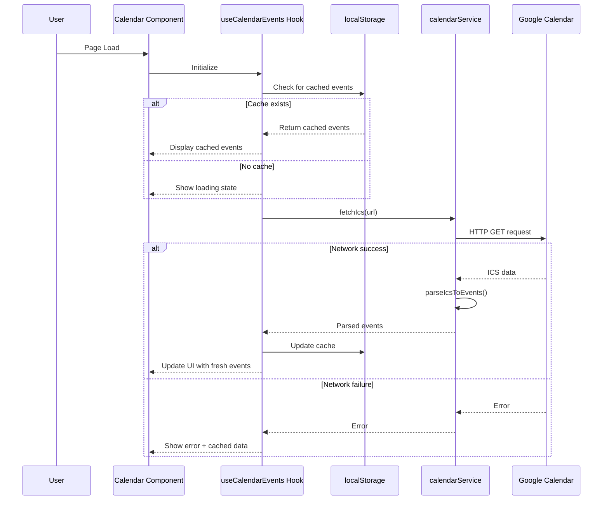
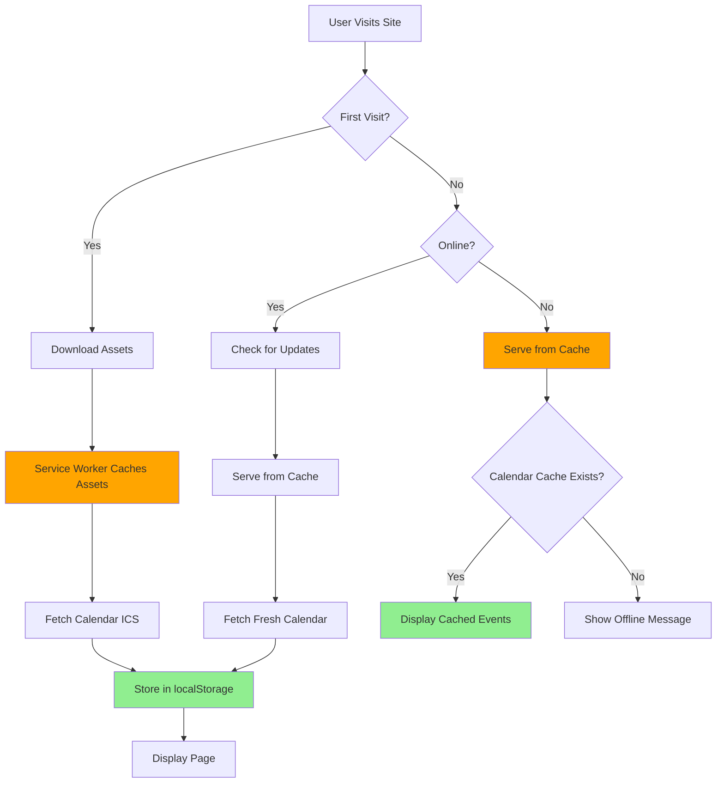
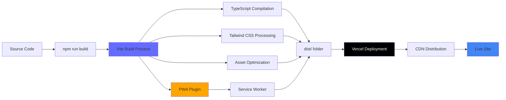
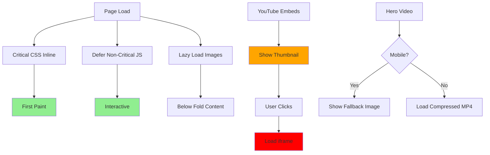
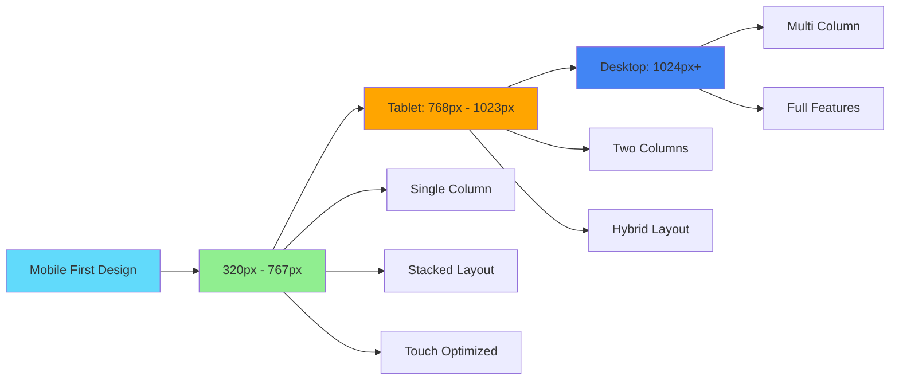
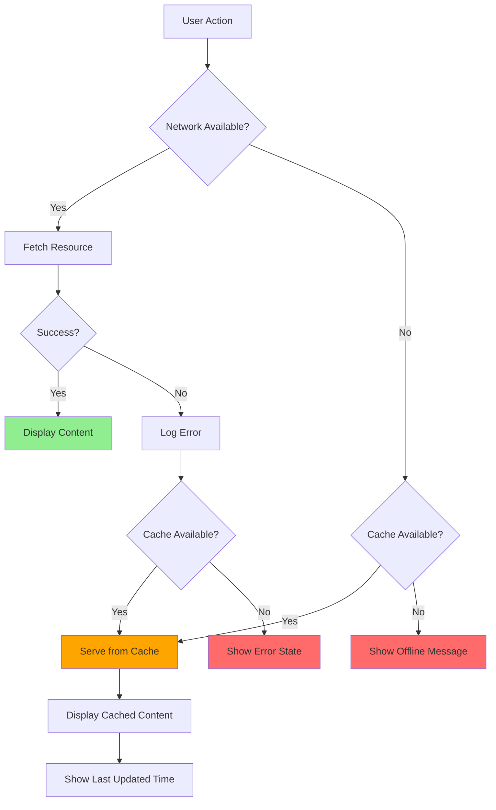
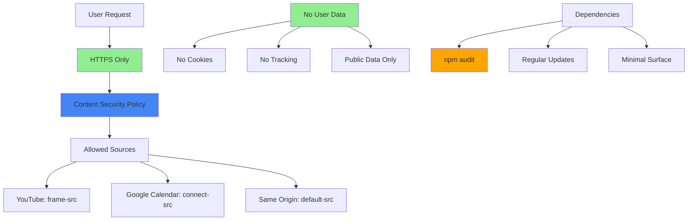

# System Architecture Diagrams

## High-Level System Overview

## Component Hierarchy

## Calendar Data Flow

## Offline Strategy Flow

## Build and Deployment Pipeline

## Content Update Workflow

```mermaid
graph TD
    subgraph Developer Updates
        A[Edit siteConfig.ts] --> B[Commit to Git]
        B --> C[Push to GitHub]
        C --> D[Vercel Auto-Deploy]
        D --> E[Live Site Updated]
    end
    
    subgraph Client Updates Calendar
        F[Open Google Calendar] --> G[Add/Edit Event]
        G --> H[Save Event]
        H --> I[ICS Feed Auto-Updates]
        I --> J[User Visits Site]
        J --> K[Fresh Events Fetched]
        K --> L[Calendar Displayed]
    end
    
    style A fill:#90ee90
    style F fill:#4285f4
    style D fill:#000000,color:#fff
    style K fill:#61dafb
```

## Performance Optimization Strategy

## Responsive Breakpoint Strategy

## Error Handling Flow

## Security Layers

---

## Legend

- **Blue (#61dafb)**: React/Frontend Components
- **Orange (#ffa500)**: Service Worker/PWA Features
- **Green (#90ee90)**: localStorage/Caching
- **Google Blue (#4285f4)**: External Services
- **Red (#ff0000)**: YouTube/Third-party
- **Black**: Build Tools/Deployment
- **Red (#ff6b6b)**: Error States

---

## Notes

These diagrams provide a visual representation of the system architecture. They should be referenced during implementation to ensure all components are built according to the planned design.

For detailed implementation specifics, refer to:
- [`AGENT.md`](../AGENT.md) - Project guidelines
- [`architecture.md`](architecture.md) - Detailed architecture documentation
- [`plan.md`](../plans/plan.md) - Implementation checklist
